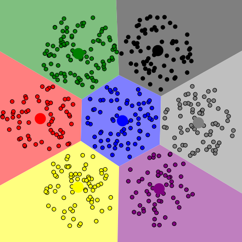
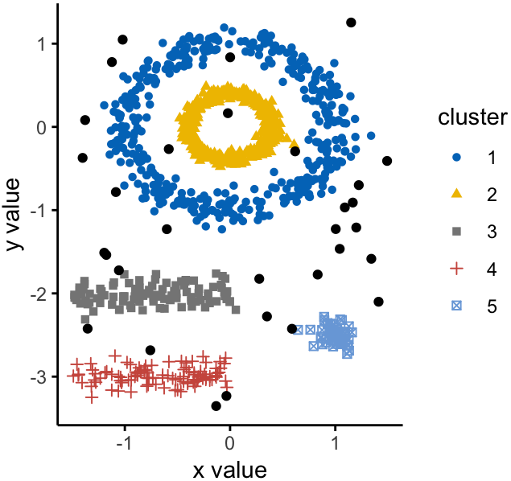

## Clustering Algorithms {#clustering}
Clustering algorithms identify dense areas in data and group data points in such areas into clusters.
They are used for numerous tasks, across multiple fields.
In the context of this thesis the biggest interest is in their utilization for visual aid.
While clustering algorithms do not visualize data themselves, they can be used in combination with visualization methods.
@fig:low_dim_visualizations [^figure_low_dim_notes] shows an exemplary selection of visualization techniques and how they can be combined with clustering.

{width=32% #fig:low_dim_visualizations_a}\hfill
{width=33% #fig:low_dim_visualizations_b}\hfill
{width=32% #fig:low_dim_visualizations_c}

Examples for the combination of clustering algorithms with visualization techniques.

Clustering algorithms share approaches and subroutines with dimensionality reduction algorithms.
They are used in the same domain, so exploring them allows for broader insight into the field of data analysis.
The following subsections covers K-Means and DBSCAN, two algorithms that are commonly used in practice.
The algorithms' approaches on how to cluster points are distinct, yielding from different concepts of clusters.

### K-Means
K-Means, also known as Lloyd's algorithm, is a clustering algorithm publically published in 1982  [@Lloyd1982].
It is a standard algorithm for finding clusters and is frequently used in machine learning and related fields.
Common libraries used in these fields include implementations of the K-Means algorithm, i.e. tensorflow [^kmeans_tf] and scikit-learn [^kmeans_scikit].

K-Means is based on a centroid approach to clusters.
It expects a cluster to be representable through its centroid, the mean of all points belonging to the cluster.
This intuitive concept of clusters defines the task of finding all clusters to finding the center of each cluster.
(For other concepts of clusters see e.g. section 2.1.2.)
If the amount of clusters is known beforehand, then a converging algorithm such as K-Means can be constructed.

Starting with a randomized initialization for all $K$ centroids $\mathcal{C}$, K-Means assigns each $M$-dimensional data point $x_i$ of an input set $\mathcal{X}$ to the centroid $\mu_j$ closest to it.
As a distance measure the Euclidean metric is used.
After every point was processed, the clusters' centers are recalculated.
New centroids are calculated by averaging over the positions of all data points belonging to a cluster.
The previous steps are repeated until the algorithm eventually converges.
Convergence has been reached when the centroids are no longer moved.
The result is a desired partitioning of the data into $K$ clusters $\mathcal{C} = f_{\texttt{K-Means}}(\mathcal{X})$.

Algorithm \autoref{kmeans_algo} shows a pseudo code version of K-Means.
@fig:kmeansconvergence shows how the algorithm converges by repeating the steps of assigning points to the closest cluster centroid and repositioning the centroids according to the points they represent.

\begin{algorithm}[H]
\label{kmeans_algo}
\SetKwInOut{Input}{Input}\SetKwInOut{Output}{Output}
\SetKwRepeat{Do}{do}{while}
\Input{data set $\mathcal{X} = {x_1, …, x_N}$

 \ \ \ \ \ \ \ \ \ \ \ \ \ amount of clusters $K$. }
\Output {set of clusters, defined via their centroids $\mathcal{C} = {\mu_1, …, \mu_K}$. }
\DontPrintSemicolon
\BlankLine
    randomly initialize the $K$ cluster centroids $\mathcal{C} = {\mu_1, …, \mu_K}$
    
    \Do {centroid positions changed in iteration; but no more than I times}{
        \ForEach {$x_i \in \mathcal{X}$} {
            assign data point $x_i$ to the cluster $\mu_j$ closest to it (minimize $||x_i - \mu_K||$ with $\mu_K \in \mathcal{C}$)
        }
        \ForEach {$\mu_i \in \mathcal{C}$} {
            recalculate cluster centroid $\mu_i$ by averaging all points belonging it
        }
    }
\caption{K-Means}
\end{algorithm}

The algorithm has a time complexity of $\mathcal{O}(I K N M)$.
$I$ hereby refers to the amount of iterations which the main algorithm loop is executed.
As stated in [@Manning2012], p. 364, $I$ can be fixed "in most cases", as the clusters found by K-Means only undergo negligible changes after a certain amount of steps.
Hence, $I$ is not required as an input parameter.

The remaining complexity stems from inside the main loop.
For each of the $N$ data points the Euclidean distance to each of the $K$ clusters is calculated.
The repositioning of the $K$ clusters has a lower complexity of $N M$ since each data point is only used in the calculation of its respective centroids' new mean.
Overall, K-Means is linear in the amount of clusters, number of data points and data dimensions.

While K-Means is commonly fast due to this linear nature, it also has multiple downsides.
The input of $K$ requires a user to know how many clusters the data consists of.
A common solution to this problem is to run K-Means with numerous inputs of $K$.
Another problem is that of data being clustered in unexpected, counterintuitive ways.
This problem often arises when data has clusters of varying size or density.
Several variants such as K-Means++ [@Arthur2007] try to solve this problem by improving the initialization of the centroids.
<!--more: https://arxiv.org/abs/1209.1960-->
<!--possible example http://varianceexplained.org/r/kmeans-free-lunch/-->
<!--downside: noise-->
The theoretical problem that K-Means does not always find the optimal cluster assignment is still unavoidable.
As shown in [@Aloise2009], finding clusters "in general dimension is NP-hard for $K=2$".
Thus a linear algorithm can only ever provide an approximation.

Parallelization of K-Means can be achieved straightforward.
The assignment step, where data points are assigned to clusters, can be computed independently for each data point.
Similarly the repositioning of the centroids can be done in parallel, since the centroid positions are independent of one another.
In between these steps synchronization is needed.
Parallelized implementations using MPI and OpenMP [^kmeans_mpi] exist, as well as a CUDA version that uses data parallelism [^kmeans_cuda].

![Shown are the intermediary steps of the K-Means algorithm until convergence. (a) starts by defining two arbitrary cluster centers. The remaining steps show the alternation between assigning the points to the cluster nearest to them (indicated by a line) and recalculating the cluster centers. The figure is taken from [@Bishop2007], figure 9.1.](figures/chapter2/kmeans.png){#fig:kmeansconvergence short-caption="Convergence of the K-Means algorithm."  width="69%"}

### DBSCAN
One of the biggest disadvantages of the K-Means algorithm is that it relies on the assumption of all clusters having one single center.
This effectively prevents discovery of shapes other than spherical, especially non-convex forms.

DBSCAN, short for "Density Based Spatial Clustering of Applications with Noise" was introduced in 1996 by Ester et. al. [@dbscan].
Instead of assigning each data point to a center, the algorithm takes a different approach.
It considers clusters to be dense point clouds.
@fig:dbscanexample [^dbscan_example_src] shows examples of what shapes clusters recognized by DBSCAN can have.

If a data point has more than a certain amount of points close to it, DBSCAN defines that area as dense.
All points inside this dense area form a cluster.
A cluster is discovered by starting from a data point $x_i$ with at least $minPts$ other points in its $\varepsilon$-neighborhood.
For the point and it's neighbors $\mathcal{N}(x_i)$ a new cluster $c_j$ is created.
All neighboring points that also fulfill the criteria of having enough points in their own neighborhood are used to expand the cluster by adding these neighbors.
Through repeating this procedure, clusters of arbitrary shapes can be found, given that they are connected and fulfill the density constraint.

Algorithm \autoref{dbscan_algo} shows an outline of how the algorithm can be implemented.
The result is a desired partitioning of the data into a set of clusters $\mathcal{C} = f_{\texttt{DBSCAN}}(\mathcal{X})$.
The amount of found clusters is unknown beforehand.
It is determined only by the input parameters and the structure of the input data.

\begin{algorithm}[H]
\label{dbscan_algo}
\SetKwInOut{Input}{Input}\SetKwInOut{Output}{Output}
\SetKwRepeat{Do}{do}{while}
\Input{data set $\mathcal{X} = {x_1, …, x_N}$,

    \ \ \ \ \ \ \ \ \ \ \ \ \ maximum radius for cluster connectedness $\varepsilon$,

    \ \ \ \ \ \ \ \ \ \ \ \ \ minimum amount of points needed for a dense region \textit{minPts}.}
\Output{a set of clusters $\mathcal{C} = {c_1, c_2, …}$. }
\DontPrintSemicolon
\BlankLine
    \For {previously unprocessed data point $x_i \in \mathcal{X}$}{
        retrieve neighbors of $x_i$ within an $\varepsilon$ radius $\mathcal{N}(x_i)$
        
        \eIf {$\mathcal{N}(x_i)$ has more than \textit{minPts}} {
            create new cluster $c_j$ consisting of $x_i$ and $\mathcal{N}(x_i)$
            
            initialize a new search set $\mathcal{S} = \mathcal{N}(x_i)$
            
            \ForEach {$s \in \mathcal{S}$} {
                retrieve neighbors of $s$ within an $\varepsilon$ radius $\mathcal{N}(s)$
                
                \If{$\mathcal{N}(s)$ has more than \textit{minPts}} {
                    add $\mathcal{N}(s)$ to cluster $c_j$ and search set $\mathcal{S}$
                }
            }
            
        } {
            mark $x_i$ as noise
        }
    }
\caption{DBSCAN}
\end{algorithm}

{#fig:dbscanexample short-caption="Example of non-convex clusters found by DBSCAN."  width="50%"}

The original publication [@dbscan] claims the time complexity of DBSCAN is $\mathcal{O}(N \log(N))$, at least in practice.
This can be achieved by the usage of R*-trees for spatial queries, so that the neighbor search can be done in $\mathcal{O}(\log(N))$ on average.
Since every point is only processed once, this leads to the claimed average complexity.

As stated in [@Gan2015], the worst case runtime complexity of DBSCAN still remains $\mathcal{O}(N^2)$[^dbscan_runtime].
Furthermore, it is shown that the best algorithm to solve the same problem as DBSCAN in three or higher dimensional space can not be faster than $\Omega(N^{(4/3)})$.
The publication presents an approximating variant of DBSCAN which has a guaranteed time complexity of $\mathcal{O}(N)$ and which yields results are equal to those of DBSCAN within a certain margin of error.

The way DBSCAN constructs clusters, expanding them by adding one point after another, makes it difficult to parallelize the algorithm.
For a parallelization this inherently sequential data processing needs to be done in a distributed manner.
Multiple parallel variants of DBSCAN exist, solving this problem in different ways.
[@Gotz2015] gives a broad overview on previous approaches, before continuing to provide its own variant, HPDBSCAN.

With HPDBSCAN, Götz et al. propose to use a spatial data structure to partition the input data.
These partitions are then distributed to be searched for clusters independently.
Afterwards the found clusters are merged and checked for uniqueness.
The results show that an implementation of this approach can scale very well, enabling a next to linear speedup.

In general, most parallel algorithm variants of DBSCAN scatter the input data among multiple processors, where it is searched for clusters in parallel.
Afterwards found clusters are merged, depending on the way the algorithm variant is designed.
Certain variants use set unions to merge found clusters, others use a master slave model, where the merging is done on only one computing unit.
Overall, the sequential data access problem of the sequential version can be overcome with these strategies.

[^figure_low_dim_notes]: @fig:low_dim_visualizations_a was created with an online tool for vizualizing how the K-Means algorithm functions (https://www.naftaliharris.com/blog/visualizing-k-means-clustering/, last accessed 20.04.2019).
@fig:low_dim_visualizations_b and @fig:low_dim_visualizations_c are taken from [@Heer2010].
Their original sources are respectively https://www.naftaliharris.com/blog/visualizing-k-means-clustering/, last accessed 20.04.2019 and https://homes.cs.washington.edu/~jheer//files/zoo/ex/stats/parallel.html, last accessed 20.04.2019.
[^kmeans_tf]: https://www.tensorflow.org/api_docs/python/tf/contrib/factorization/KMeans, last accessed 20.04.2019
[^kmeans_scikit]: https://scikit-learn.org/stable/modules/generated/sklearn.cluster.KMeans.html, last accessed 20.04.2019
[^kmeans_cuda]: https://github.com/serban/kmeans, last accessed 20.04.2019
[^kmeans_mpi]: http://users.eecs.northwestern.edu/~wkliao/Kmeans/index.html, last accessed 20.04.2019
[^dbscan_example_src]: The graphic of @fig:dbscanexample was taken from https://www.datanovia.com/en/lessons/dbscan-density-based-clustering-essentials/, last accessed 20.4.2019
[^dbscan_runtime]: This time complexity still neglects the dimensions of the data set to cluster. A factor of $M$ can be added for $\mathcal{O}(N^2 M)$, but is, in contrary to K-Means, commonly skipped in literature.
