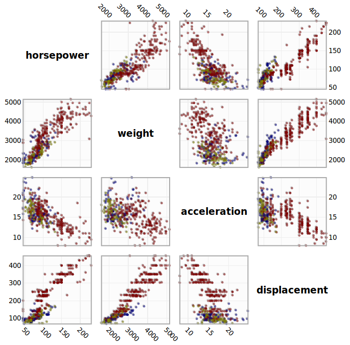
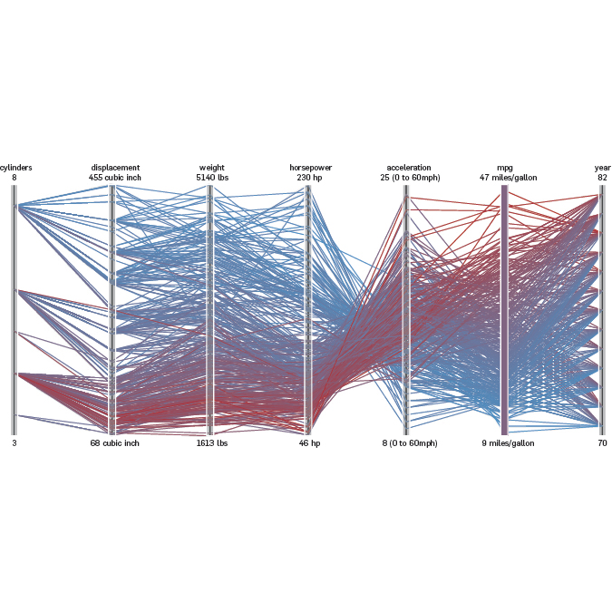

## Clustering Algorithms {#clustering}
Clustering algorithms identify dense areas in data and group data points in such areas into clusters.
They are used for numerous tasks, across multiple fields.
In the context of this thesis the biggest interest is in their utilization for visual aid.
While clustering algorithms do not visualize data themselves they can be used in combination with visualization methods.
@fig:low_dim_visualizations [^figure_low_dim_notes] shows an exemplary selection of visualization techniques and how they can be combined with clustering.

{width=33% #fig:low_dim_visualizations_a}
{width=33% #fig:low_dim_visualizations_b}
{width=34% #fig:low_dim_visualizations_c}

Examples for the combination of clustering algorithms with visualization techniques.

Clustering algorithms share approaches and subroutines with dimensionality reduction algorithms.
They are used in the same domain, so exploring them allows for broader insight into the field of data analysis.
The following subsections covers k-means and DBSCAN, two algorithms that are commonly used in practice.
The algorithms' approaches on how to cluster points are distinct, yielding from different concepts of clusters.

[^figure_low_dim_notes]: @fig:low_dim_visualizations_a was created with an online tool for vizualizing how the k-means algorithm functions (https://www.naftaliharris.com/blog/visualizing-k-means-clustering/, last accessed 20.04.2019).
@fig:low_dim_visualizations_b and @fig:low_dim_visualizations_c are taken from [@Heer2010].
Their original sources are respectively https://www.naftaliharris.com/blog/visualizing-k-means-clustering/, last accessed 20.04.2019 and https://homes.cs.washington.edu/~jheer//files/zoo/ex/stats/parallel.html, last accessed 20.04.2019.
<!--TODO maybe fix this mess when almost done-->

<!--[^kmeans_visualization]:https://www.naftaliharris.com/blog/visualizing-k-means-clustering/, last accessed 20.04.2019-->
<!--[^scatter_plot]: https://homes.cs.washington.edu/~jheer//files/zoo/ex/stats/splom.html, last accessed 20.04.2019-->
<!--[^parallel_coordinates]: https://homes.cs.washington.edu/~jheer//files/zoo/ex/stats/parallel.html, last accessed 20.04.2019-->
