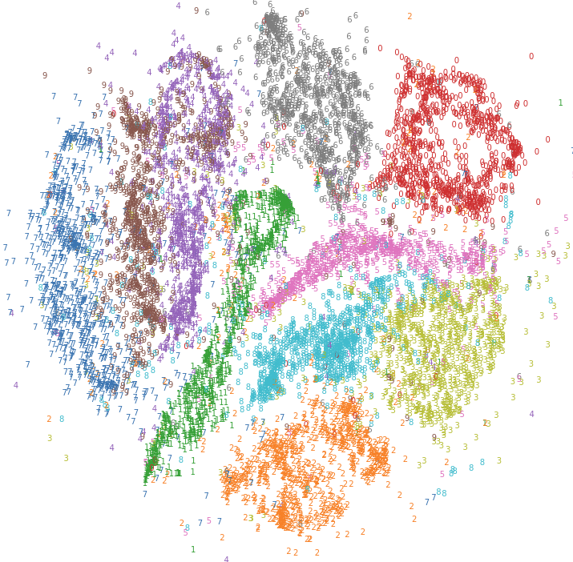

# Methods {#methods}

## Profiling UMAP
To parallelize an algorithm, it is important to know how well the individual parts of the algorithm perform.
Parallelizing a part that hardly contributes to the algorithm's running time, will not result in a noticeable speedup.
By analysing the algorithm through profiling, the parts that take longest to execute can be found.
Parallelizing these will have the biggest impact to improve the performance of the algorithm.

table running times digits, iris, LFW, mnist, cifar

@fig:3d_profile_plots_orig shows the results of profiling UMAP with multiple data sets of different sizes $N$ and dimensions $M$.
The two data sets used for the profiling  were

Two things can be seen:

* The running time of UMAP

* The structure of the input data has significant impact on the running time.

UMAP has 
{#fig:tfjs-tsne short-caption="Visualization of an MNIST subset by Pezzotti et al.'s t-SNE variation." width="50%"}

consist of many parts

for a parallelization effort the parts that contribute most to the execution time

graphic of 

show how performance depends on the input data 
preprocess with PCA,
not lowering dimensions
just decomposing data into principal components
faster

## Parallelizing UMAP

table steps simlarity to other algorithms

|Algorithm phase| Equivalent exist in | Parallelization exists |
|-------------------|--------------|---------------|
|KNN search|t-SNE| Yes, multiple|
|Spectral layout initialization | - | No |
|SGD| - | Similar |

## Parallelization of Nearest-Neighbor Search

common problem in ML and data analysis

various implementations exist 
<!--https://github.com/erikbern/ann-benchmarks-->
reference ANN benchmark

## Parallelization of Stochastic Gradient Descent

## Parallelization of Stochastic Gradient Descent
The stochastic gradient descent
iterating over edges, writing to both nodes

data access reordering, only write to one y in one process to avoid write conflicts

 

negative sampling

replace check $k==j$ with $ k = k + j % max-1$

init cuda 0.3776082992553711 seconds

