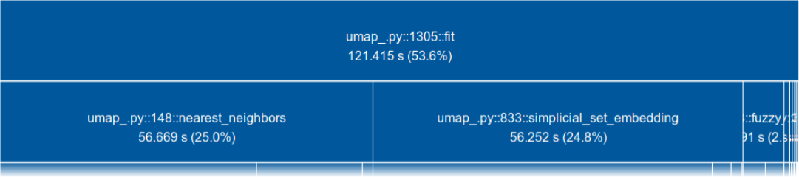
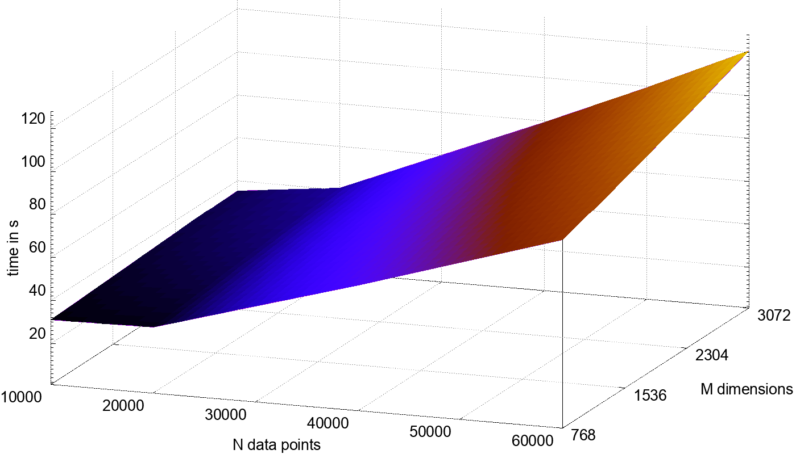
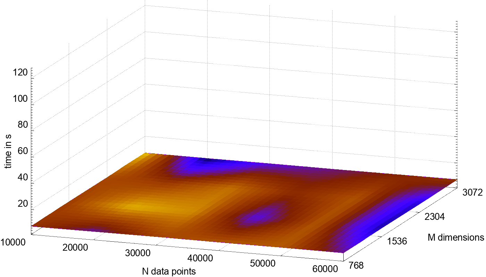
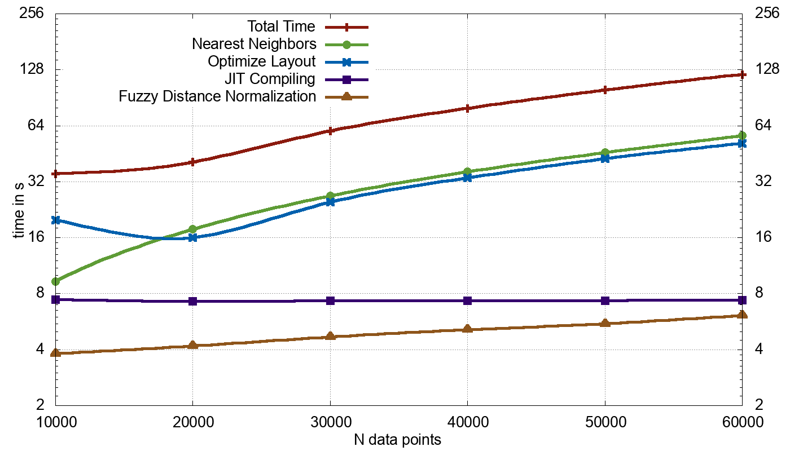
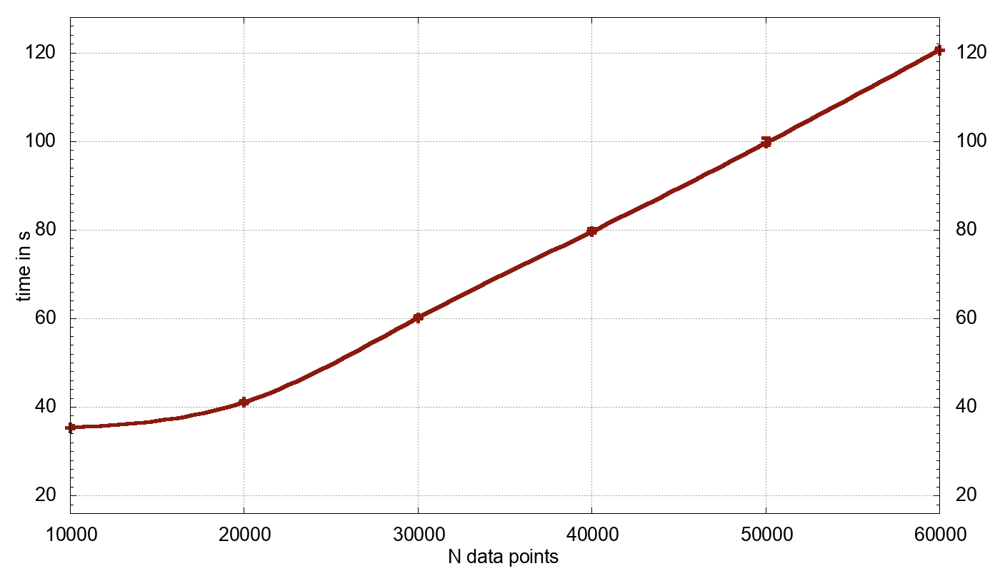

# Methods {#methods}
This chapter is comprised of three parts.
In the first, UMAP is profiled in order to determine which parts of the algorithm should be parallelized.
In the second, approaches to parallelizing the found algorithm steps are given.
The last section concludes the chapter with a mapping of the parallelized algorithm steps onto the pseudo code of UMAP.

## Profiling UMAP
To efficiently parallelize an algorithm, it is important to know how well the individual steps of the algorithm perform.
Parallelizing a part that hardly contributes to the algorithm's running time, will not result in a noticeable speedup.
By profiling the algorithm, the parts that take longest to execute can be found.
Parallelizing these parts will have the biggest impact on the performance of the algorithm.

UMAP is a general dimensionality reduction algorithm and is thus applicable to a multitude of data sets.
Throughout the following profiling a wide selection of data sets is used, in order to capture how the performance varies for different inputs.
The data sets are:
the Iris flower data set [@iris],
the Pen Digits data set [@digits],
the COIL-20 [@coil20] and COIL-100 [@coil100] data sets,
the Labeled Faces in the Wild (LFW) data set [@lfw],
the MNIST data set [@mnist],
the Fashion-MNIST data set [@fashion-mnist],
the CIFAR-10 data set [@cifar10] and
the GoogleNews word vectors data set [@googlenews].
For each data set the number of samples $N$ and dimensionality $M$ is given in the profiling table.
The majority of these data sets are also used to measure algorithm performances in the original UMAP publication [@umap].
Since this thesis focuses on using UMAP for visualization, all data sets are reduced to two dimensions.
All UMAP input parameters are set to the implementation's default values.
<!--, allowing for a validation of the publication's claimed execution times.-->

All profiling is performed on a system with an Intel® Core™ i7-7700 CPU with 8 cores and 16 GB of main memory.
UMAP in version 0.3.8 is used along with Numba version 0.43.1.
The operating system is Archlinux with kernel version 5.0.7 and Python 3.7.3.

The standard Python profiler [^pyprof] is used for accurate timing.
It measures the time spent on each function of the program.
This enables the identification of program parts that take long to execute and therefore are good candidates for parallelization.

@fig:tuna-mnist shows a visualization of profiling data generated by processing the MNIST data set.
The graphic is taken from the interactive output that was generated by the `tuna` Python package[^tuna_src] for the profiling data.
As can be seen, the total runtime is dominated by few functions.
The percentages in the graphic include loading times of data sets and libraries and are therefore too low.
Nonetheless more than half of the time is spent in the `simplicial_set_embedding` method.
It performs the initialization and optimization of the low-dimensional representation.
Other significant contributions are made by the `nearest_neighbors` method, which performs a KNN search, and the `fuzzy_simplicial_set` method, which normalizes distances between data points found by KNN search (as illustrated in @fig:umap_radii).

{#fig:tuna-mnist short-caption="Profiling of UMAP on the MNIST data set." width="100%"}

UMAP uses Numba [@numba], a Just-In-Time (JIT) compiler.
It compiles source code "on the fly" during execution of the program.
Consequently the time taken for these compilations also accounts for parts of the run time.
This time is not prominently present in @fig:tuna-mnist, since compiling is done at several occasions during the execution.

<!--regex to create table from .dat data file-->
<!--\n([^ \n]+) ([^\n ]+) ([^ \n]+) ([^ \n]+) ([^\n ]+) ([^ \n]+) ([^ \n]+) ([^ \n]+) [^\n]+ \n-->
<!--\n|\1|\2|\3|\5|\7|\6|\8|\4|\n-->
|Data Set|$N$|$M$|UMAP|Total|KNN|Fuzzy|Embed|JIT|
|----|--:|--:|----:|----:|----:|----:|----:|----:|
|Iris|150|4|-|5.59|0.00|3.41|0.23|5.21|
|COIL-20|1440|16384|12|10.11|0.07|3.53|2.14|5.26|
|Pen Digits|1797|64|9|8.38|0.13|3.55|2.90|5.19|
|LFW|13233|2914|-|27.51|11.04|3.95|10.09|7.23|
|COIL-100|7200|49152|85|53.41|33.85|3.76|13.25|7.393|
|MNIST|70000|784|87|85.12|19.84|6.50|51.88|7.23|
|Fashion-MNIST|70000|784|65|90.55|22.42|6.56|54.47|7.31|
|CIFAR|60000|3072|-|121.42|56.67|6.19|51.58|7.31|
|GoogleNews[^googlenews]|200000|300|361|311.36|87.26|12.57|177.77|7.10|
|GoogleNews$^3$|500000|300|-|1050.00|277.40|26.36|738.19|7.25|

Table: Profiling of UMAP on various data sets. \label{umap_various_times}

In Table \ref{umap_various_times} the times measured in the UMAP publication (UMAP) are compared to the times of the profiling (Total).
The latter is further broken down into time spent on each of the dominating methods, `simplicial_set_embedding` (Embed), `nearest_neighbors` (KNN) and `fuzzy_simplicial_set` (Fuzzy), along with accumulated time spent on compiling (JIT).

<!--TODO explain times, esp JIT -->
The table shows differences between the times of the publication and the profiling.
This could be caused by recent changes to the implementation or differences of the used hardware.
Overall, the times are of the same magnitude.
The differences in JIT times are due to an optimization of the implementation, which uses a non-compiled KNN algorithm for small data sets.

All data sets were made contiguous in the main memory, meaning that they were placed consecutively in memory without any fragmentation.
Initial test profilings did not assure the data to be contiguous, which resulted in implausibly high execution times.
In these test runs a visualization of the MNIST data was performed in 436.5 seconds, 5 times slower than the contiguous version.
A processing of the CIFAR-10 data set even took 3033 seconds, 25 times as long as the revised running time.

To estimate the influence of the data set's number of samples and dimensions on the running time, a separate profiling is performed.
UMAP is hereby applied to reduced versions of the CIFAR data set.
A reduction is made in equidistant steps for both, the data set size and dimensionality.
The size is reduced in steps of 10.000 data points, the dimensionality is reduced in steps of 25% of the original number of dimensions.
<!--This is done by dropping rows columns-->
CIFAR was chosen, because it is big enough to allow for the creation of meaningful subsets through reduction, while still being small enough to be processed repetitively in a feasible time frame.

{#fig:prof_n_and_m_cifar width="80%"}

As the visualized profiling results of @fig:prof_n_and_m_cifar show, the running time of UMAP is influenced stronger by the amount of samples, than by the dimensionality.
Processing only half of all data points reduces the running time more, than processing the same amount of data with only a fourth of the dimensions.
@fig:prof_n_and_m_methods shows how this is reflected in the individual methods of UMAP.
It shows the contribution of each method that resulted in the total running time of @fig:prof_n_and_m_cifar.

{width=45% #fig:prof_n_and_m_methods_a}\hfill
{width=45% #fig:prof_n_and_m_methods_b}

{width=45% #fig:prof_n_and_m_methods_c}\hfill
{width=45% #fig:prof_n_and_m_methods_d}

Time spent by individual methods processing reduced CIFAR data sets.

<!--for different sizes of CIFAR, -->

JIT compiling always takes approximately the same amount of time and is not affected by the input data.
Similarly, `fuzzy_simplicial_set` stays almost constant, indicating only little growth with the data set size.
The real differences in total stem from the `nearest_neighbors` and `simplicial_set_embedding` methods.
Both show a linear growth.
The KNN search does depend on size and dimensionality of the input data, whereas the layout optimization works with the low-dimensional representation created by UMAP and only is affected by the size and number of dimensions to reduce to.

A clearer comparison of these times is given in @fig:prof_n_and_m_2d_cifar.
For it, solely the data set size has been altered, while the original dimensionality was kept.
An analogous breakdown for a profiling of MNIST with the same range of data set size, shows how the approximately four times higher dimensionality of CIFAR affects the running time.

{width=80% #fig:prof_n_and_m_2d_cifar}

\pagebreak
<!--### Variation of Execution Time-->
Finally, a profiling to analyze how deterministic UMAP behaves:
For @fig:determinism UMAP was performed on subsets of the CIFAR data set a total of 10 times.
The variation of the execution time is visualized by displaying the span between the fastest and the slowest time.
However, in the graphic the error cannot be seen, since it is small in comparison to the total time.
This leads to the conclusion, that the runtime of UMAP is deterministic.
<!--preprocess with pca to same dimensions does not have any influence on the performance-->

{width=80% #fig:determinism}

<!--TODO improve graphic-->

[^pyprof]: https://docs.python.org/3/library/profile.html, accessed 25.04.2019
[^tuna_src]: https://pypi.org/project/tuna/, accessed 25.04.2019
[^googlenews]: Profiling of the GoogleNews data set was performed on a down sampled subset, since the original data set has two million data points and did not fit in the system's main memory.
