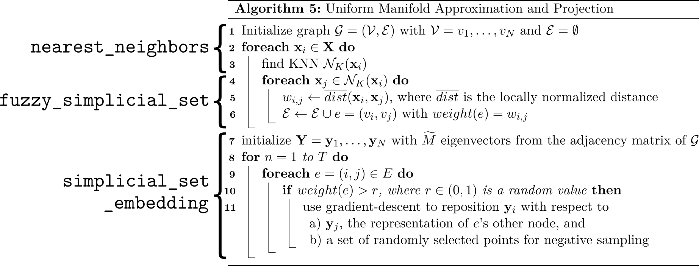

## Parallelized Subtasks of UMAP
As a summary @fig:summary_algo_steps shows which parts of the algorithm are to be parallelized and which method is responsible for them.

{width=100% #fig:summary_algo_steps}

<!--|Algorithm step|Equivalent exists in|GPU Parallelization exists|-->
<!--|-------------------|--------------|---------------|-->
<!--|KNN Search|t-SNE|Yes|-->
<!--|Distance Normalization| - | No |-->
<!--|Layout Optimization| - |No|-->

