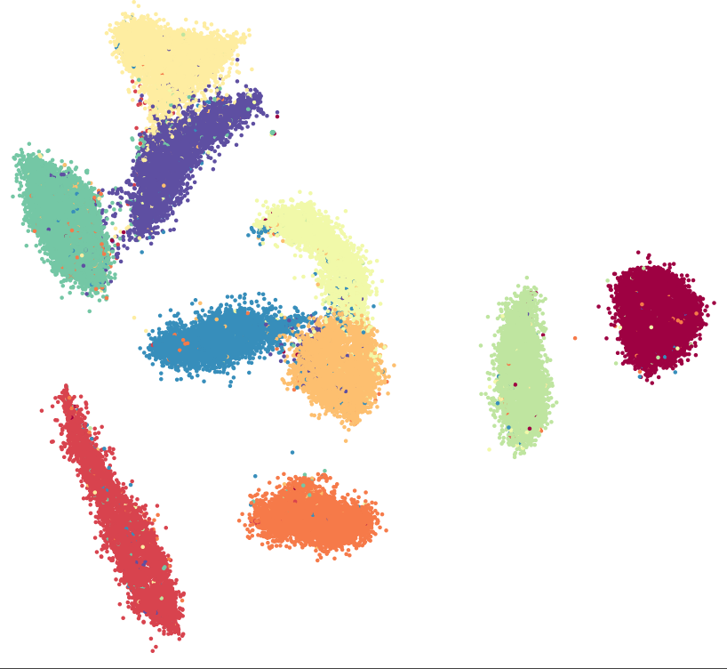
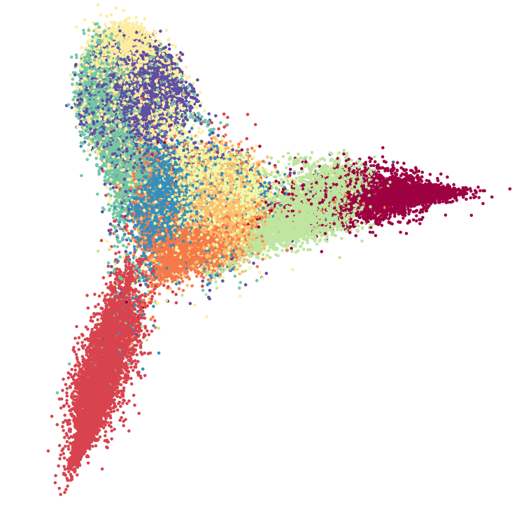
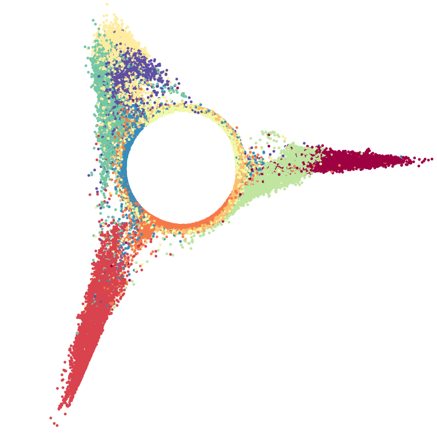
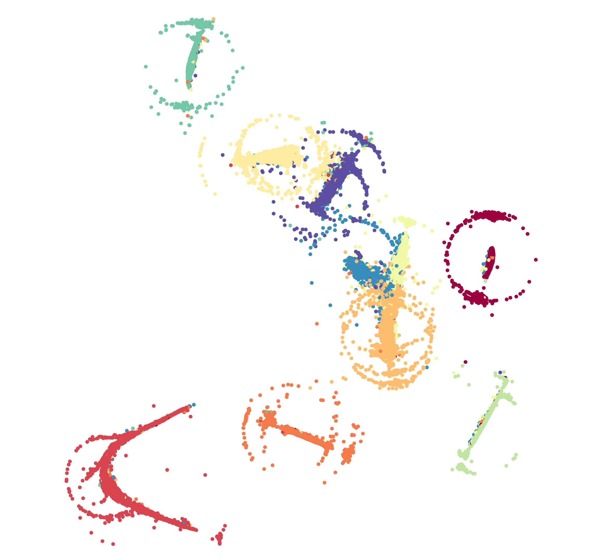

# Implementation {#implementation}
This chapter documents the implementation of GPU parallel UMAP (GPUMAP).
[Section 4.1](#technology) covers the technologies used, [Section 4.2](#detailed_implementation) gives implementation details for the parallelized algorithm steps.

## Used Technologies {#technology}
To implement UMAP on GPUs, a library to communicate with the GPU is needed.
As already argued in [Section 1.3](#aim), the choice for this thesis is to use the CUDA library.
It provides good performance, a stable API and can be widely used since the supported Nvidia® GPUs are commonly available.

In order not to start an implementation from scratch, the existing UMAP Python implementation is used as groundwork.
Building upon it, all parts found in [Chapter 3](#methods) to benefit from parallelization will be extended to support parallel execution on GPUs.
The CPU parts can still remain available and be used as a fallback if no GPU is temporarily available.

As mentioned in the previous chapter, UMAP uses Numba [@numba] to create compiled code during execution.
This allows for performant execution of computation-heavy code, without the need to rewrite it in compiled languages such as C.
The table in @fig:numba_comparison shows exemplary performance speedups when compared to standard Python code.
The JIT compilation of Numba is not limited to CPUs, it also supports "compiling a restricted subset of Python code into CUDA kernels" [^numba_cuda].
While not the complete API of CUDA is provided, all features required for this thesis are supported.
Thus, the methods described in the following sections are implemented in Python, which is JIT compiled by Numba and executed on GPUs.

![Speedups over normal Python interpreter for naive Matrix Multiplication of Numba JIT and compiled C Code via CPython. Taken from [@numba], Table 1.](figures/chapter4/numba_comparison.png){#fig:numba_comparison short-caption="Speedups over normal Python interpreter for naive Matrix Multiplication of Numba JIT and compiled C Code via CPython." width="40%"}

\pagebreak

## Implementation Details {#detailed_implementation}
The proceeding sections each cover details on the implementations of one method for the GPU.
To be easier to follow, they are sorted in the order that they appear in the algorithm.

### `nearest_neighbors` {#nearest_neighbors}
The first step of the UMAP algorithm is a KNN search.
It is implemented in the `nearest_neighbors` method.
To enable dynamic execution of either the CPU or the GPU version, the method is modified to either call the `nearest_neighbors_cpu` method, which contains the existing UMAP CPU version, or `nearest_neighbors_gpu`, which is the new GPU implementation.
To choose which version to call, Numba is used.
Its API provides a `cuda.is_available()` method, that can be queried whether a supported CUDA-enabled GPU is available.

The `nearest_neighbors_gpu` method is mostly a wrapper for communication with the FAISS library.
It first creates an index for the input data, on which a KNN search is to be performed, and then tasks FAISS to find the desired amount of nearest-neighbors for each data point using that index.

The chosen KNN search to be performed by FAISS is a brute-force method, since all other attempted variants performed worse.
The same holds for an implementation analogous to that of t-SNE-CUDA [@tsne-cuda].
FAISS also offers a dedicated method for a brute-force KNN search, but it performed just as fast, while running out of memory sooner than the chosen version.

Since FAISS only supports the use of an Euclidean metric, a check is performed that it also is the user-defined metric, otherwise the CPU version is used.
Further, FAISS does not support searching for more than 1024 nearest-neighbors, which therefore also causes a fallback to the CPU.

### `smooth_knn_dist`
`smooth_knn_dist` iterates over the distances calculated by the previous algorithm step, `nearest_neighbors`.
It "smooths" the distances between nearest-neighbors, by normalizing each set of edges related to one node.
The normalization is based on the node's local connectivity and done independently for each set of distances, making the method "embarrassingly parallel".
As a result, no memory access restrictions need to be managed.

For parallelization each thread is assigned a block of consecutive sets of distances.
Each set contains the distances between one node and its KNN.
By iterating over these sets, two steps are performed.
First a distance with which to normalize is determined.
That distance is then used in a binary search to normalize all values.

The original CPU code of the `smooth_knn_dist` contained a comment, that the code is "very inefficient"[^umap_code_comment].
Indeed the code does contain several redundant recalculations of mean values and passes each distances set multiple times.
The GPU code fixes this by passing calculating the mean over all values once, and calculating all other required values during a single pass of each distance set.
The rest of the implementation is mostly boiler plate code, including the branching into CPU and GPU implementation analog to the description in [Section 4.2.1](#nearest_neighbors).

### `optimize_layout` {#detail_optimize_layout}
`optimize_layout` is the implementation of the Stochastic Gradient Descent procedure.
It consists of several nested loops, in which positive and negative sampling are done.
The most outer loop iterates over the number of epochs of the SGD.
Parallelizing it is not possible, as each epoch builds on the processed embedding data of the previous one.

The loop nested one layer deeper iterates over all edges.
It can be used for parallelization, albeit not as directly as `smooth_knn_dist`, since each edge links two separate data points.
When an edge is sampled both of these points are repositioned in SGD.
Since the graph is connected, each node is part of more than one edge and parsing both nodes of the edges therefore causes data access conflicts.

A solution to avoid these conflicts is to duplicate all edges, assign the associated nodes to the duplicated edge in reversed order, and then sort all edges by their first node.
As it happens to be, this is already the case due to the way the KNN search builds the graph.
If each edge is only sampled for its first node, and one thread is responsible for all edges where this node is the first node, then the changes to this node can be written without any data write conflicts.

When processing each edge split into their two nodes, another problem occurs.
Since the nodes of the edge are processed independently, they can also read varying values due to desynchronization.
While one node of an edge could be processed at the beginning of an epoch, the other could only be processed at the end.
The nodes will be repositioned independently of each other, which also means that the weight of the edge connecting the nodes, could be badly represented after the epoch ends.
This is caused by a less obvious read-write conflict.
@fig:mnist_no_other shows an example for an embedding produced with this error.
Caches amplify the problem by providing values that are outdated, but not invalidated.

{#fig:mnist_correct width="42%"}
\hfill
{#fig:mnist_no_other width="42%"}

{width=42% #fig:mnist_hole}
\hfill
{width=42% #fig:mnist_collective_randoms}

Flawed visualizations of the MNIST data set.

The problem could be resolved by using two embeddings.
All read operations are performed on one embedding, while the changes are written to the other.
When all threads are done processing the edges assigned to them, the data sets are swapped and the procedure is repeated.
Unfortunately this requires a synchronization step over all threads after each epoch and thus performs slow.

The way the GPUMAP implementation resolves data conflicts, is a simpler one.
Instead of separately processing the two edge nodes, the nodes are both repositioned at the same time by the same thread.
Since the updates induced by a gradient descent procedure are merely shifting the data points instead of completely repositioning them, the write conflicts do not need to be avoided at all costs.
Instead of guaranteeing that all points are only written by one thread, guaranteeing that points are only written to by one thread at a time suffices.
To guarantee this, all write accesses can be wrapped in atomic, read-modify-write operations, that are guaranteed by the hardware to not cause conflicts.
The performance of these atomic operations was not distinguishable to the use of normal additions during testing.

A successful optimization of the algorithm is the use of global variables.
These are seen as constants by the Numba JIT compiler, allowing for constant folding and loop unrolling.
A specialized implementation originally fine-tuned for the embedding into two dimensions was thus made redundant, as it now performed slower than the optimized general version.

Another improvement was already covered in [Section 3.2.3](#methods_optimize_layout).
By using a pre-filtering method branching of the GPU threads can be avoided.
During the implementation it showed to bring a big performance gain, halving the previous time.
However, avoidance of branching is not just important for performance.
In @fig:mnist_hole the impact of branching can be seen.
The reason for this is the way the sequential implementation performs the random number selection for negative sampling.
 
<!--possible TODO rephrase-->

As expected, a random number is created.
It is used to randomly access a data point of the embedding.
To assure that no node of the current edge is selected, a simple `if` construct is used, that branches off and continues with the remaining loop iterations of the negative sampling.
The branching is responsible for the hole that can be observed.

Replacing the branching with a modified version of the random number generation based on equation @eq:random_number, patches the hole.
The formula can be used to select a random point $k$ out of $N$ points, while guaranteeing that a value $i$ will not be chosen.
Nested usage of the formula allows additional points to be skipped.
This way both nodes of an edge can be avoided during negative sampling.

\begin{equation}
k = \texttt{rand()} \% (N-1) + 1 - i
\end{equation}
\label{eq:random_number}

One last attempt to further improve performance is by optimizing memory access.
Since accessing any data in memory usually causes the hardware to load not just the desired data values, but the whole memory bank in which it resides, random accesses to memory are very inefficient and lead to many cache misses.
The random accesses done for negative sampling are thus very inefficient, as only a small part of the cached memory is actually used.
If a group of threads with a shared cache were to use successive nodes for negative sampling, the caching efficiency and therefore memory efficiency can increase drastically.
The downside to this approach however, is the loss of entropy.
As the result of the implementation in @fig:mnist_collective_randoms shows, the visual quality deteriorates significantly, rendering this optimization impractical.

[^numba_cuda]: from http://numba.pydata.org/numba-doc/latest/cuda/overview.html, accessed 28.04.2019
[^umap_code_comment]: https://github.com/lmcinnes/umap/blob/a858c6322a3e682d8daf9c17e13ac023f3e18cfa/ umap/umap_.py#L96, accessed 28.04.2019
