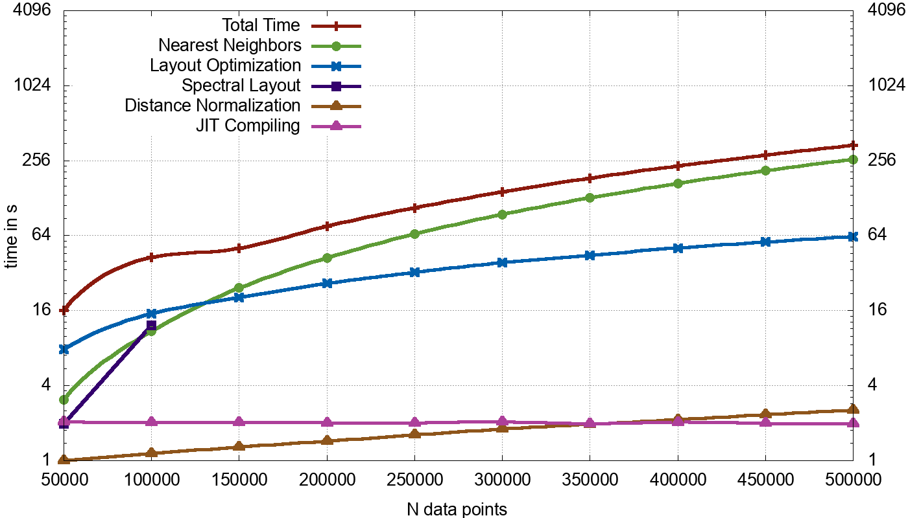
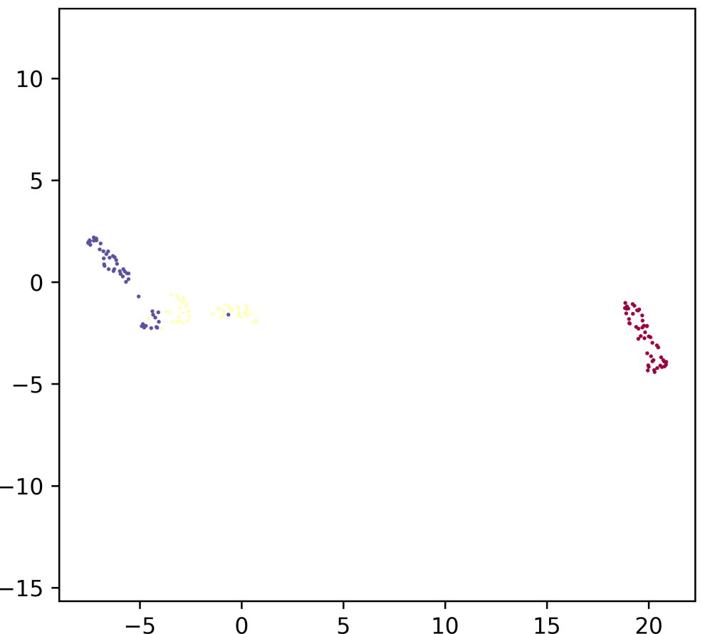
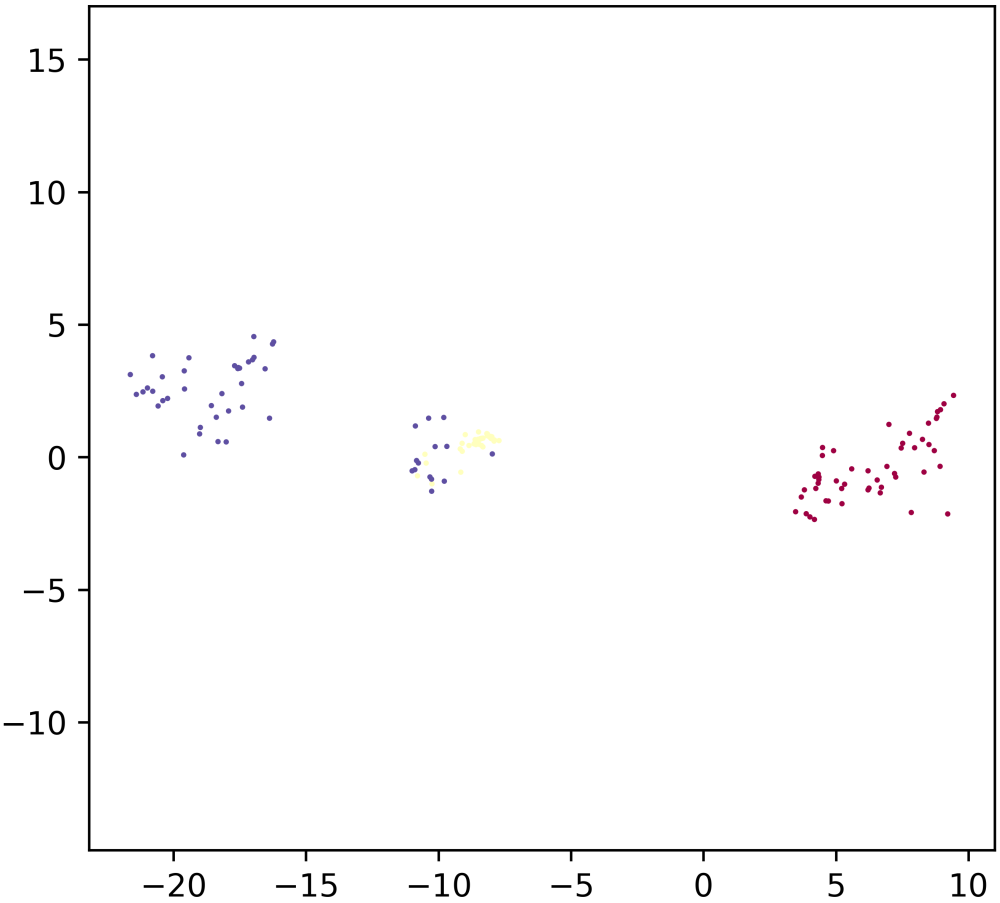
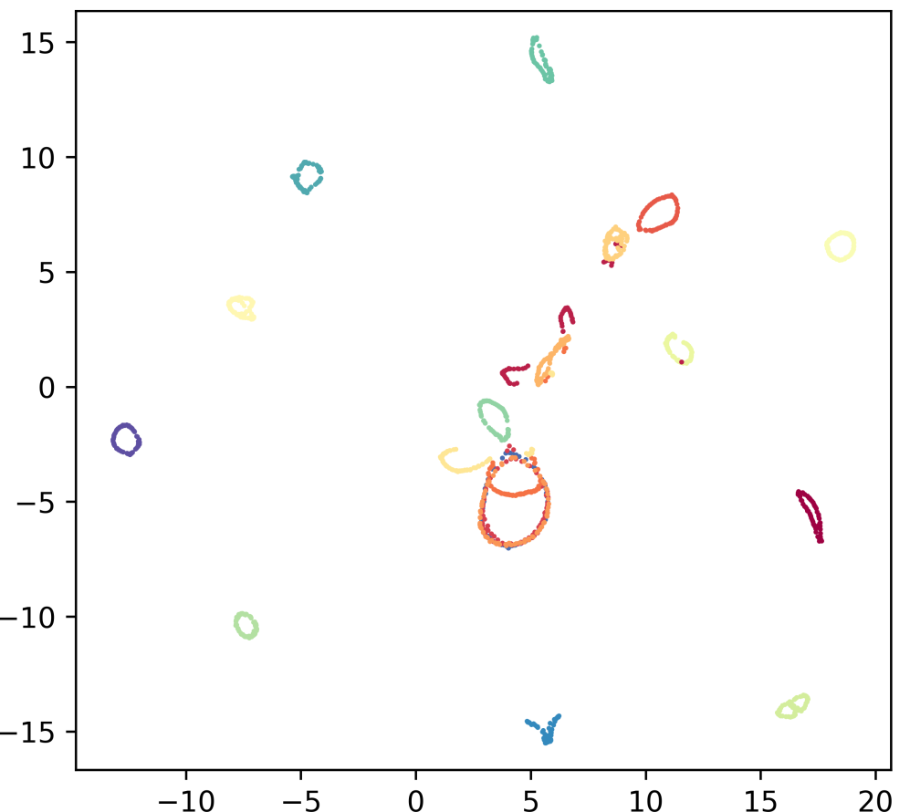
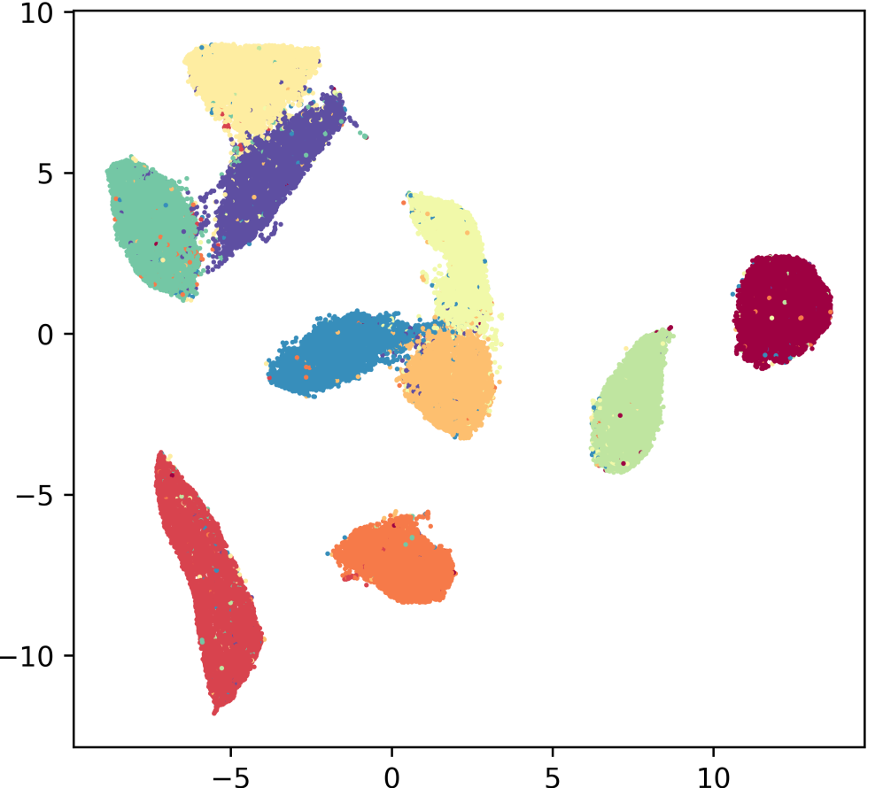
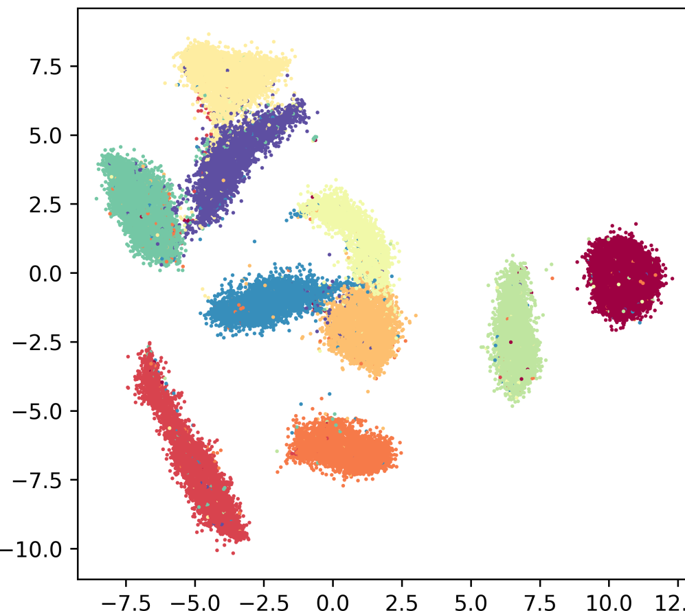
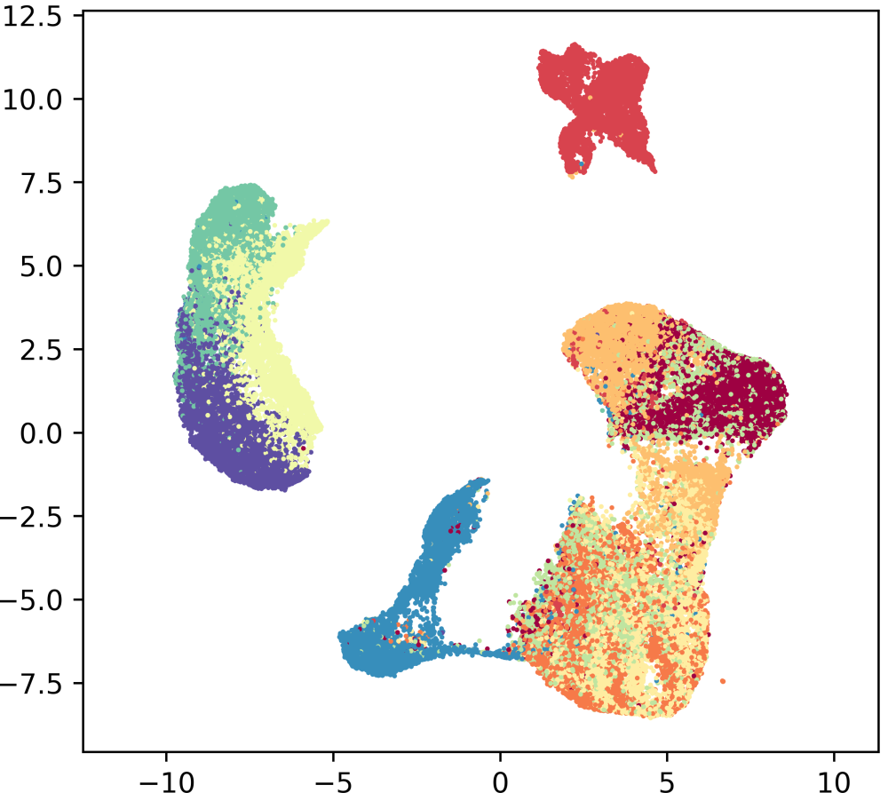
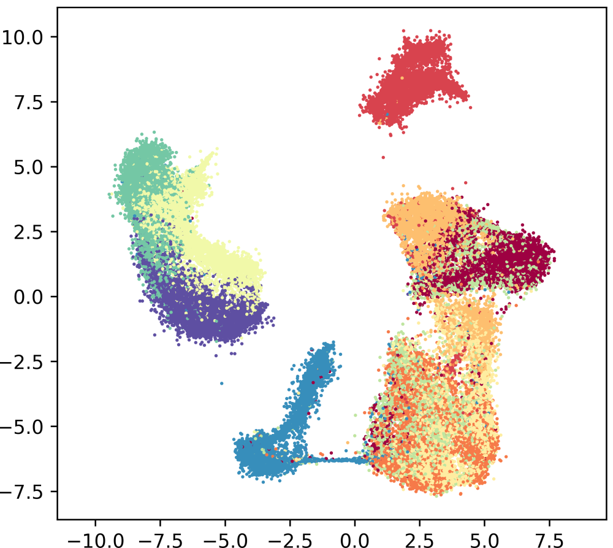
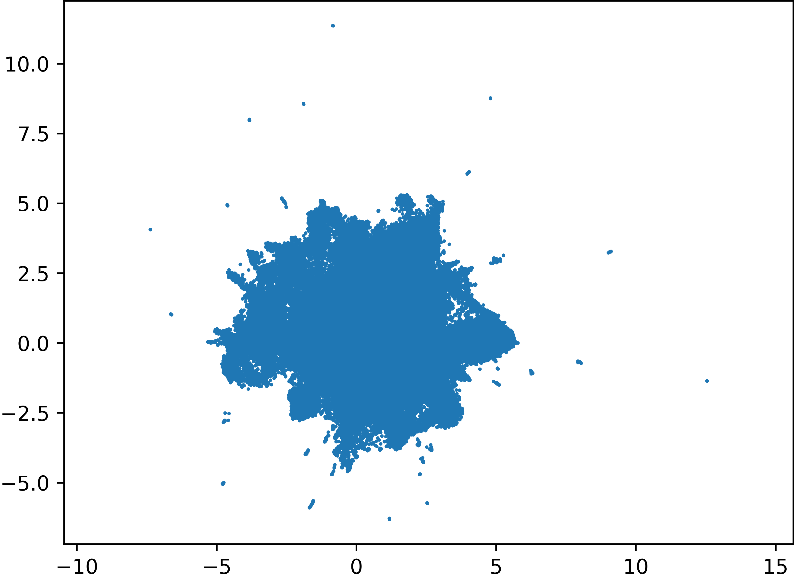
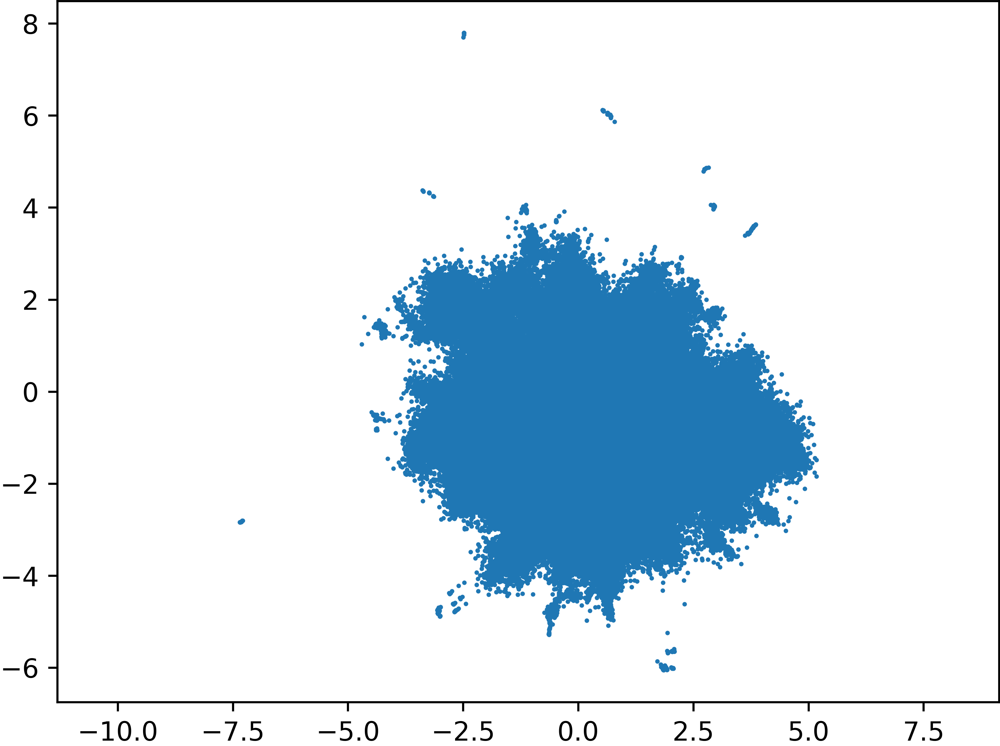

# Results
<!--no iterpretation, just objective-->
In this chapter the new implementation, GPUMAP, is profiled and compared to the CPU implementation and t-SNE CUDA.
[Section 5.1](#performance) contains performance measurements and comparisons, [Section 5.2](#visualization_quality) compares the quality of GPUMAP's visualizations.

## Performance {#performance}
To profile GPUMAP, a similar analysis to that in Chapter 3 is performed.
The hardware and software are the same, but computation power is enhanced by the usage of an Nvidia® GeForce GTX™ 745 GPU with 384 cores and 4 GB of Memory.

The times given in Table \ref{gpumap_various_times} show a breakdown of the total time into the times spent on the methods that were parallelized: `nearest_neighbors` (KNN), `fuzzy_simplicial_set` (Fuzzy) and `optimize_layout` (Optimize)
Additonally the accumulated compiling time (JIT) is listed.
Further the total time (Total) of GPUMAP is given together with the speedup achieved over regular UMAP.
A visualization of how GPUMAP performs on rising numbers of data points is shown in @fig:gpumap_plot_google_news.

<!--regex to create table from .dat data file-->
<!--\n([^ \n]+) ([^\n ]+) ([^ \n]+) ([^ \n]+) ([^\n ]+) ([^ \n]+) ([^ \n]+) ([^ \n]+) [^\n]+ \n-->
<!--\n|\1|\2|\3|\5|\7|\6|\8|\4|\n-->
<!--remove last dot-->
<!--\.([0-9])([0-9])([0-9])\|-->
<!--\.([0-9])([0-9])([0-9])\|-->

|Data Set|$N$|$M$|Speedup|Total|KNN|Fuzzy|Optimize|JIT|
|----|--:|--:|---:|---:|---:|---:|---:|---:|
|Iris|150|4|1.7|3.22|0.00|0.90|1.12|2.89|
|COIL-20|1440|16384|2.4|4.16|0.06|0.98|1.52|2.91|
|Pen Digits|1797|64|2.1|3.93|0.13|1.04|1.65|2.90|
|LFW|13233|2914|3.4|8.03|2.37|0.92|2.79|2.89|
|COIL-100|7200|49152|2.8|19.18|9.06|0.91|3.29|2.94|
|MNIST|70000|784|3.0|28.09|11.90|1.10|8.43|2.87|
|Fashion-MNIST|70000|784|3.2|28.66|11.90|1.11|8.90|2.89|
|CIFAR|60000|3072|2.5|48.76|31.89|1.08|8.60|2.88|
|GoogleNews|200000|300|4.1|76.07|42.44|1.48|26.29|2.84|
|GoogleNews|500000|300|3.1|340.68|261.69|2.62|62.94|2.88|

Table: Profiling of GPUMAP on various data sets. \label{gpumap_various_times}

The total time is, like for UMAP, still dominated by the KNN search and the embedding optimization.
The time spent on JIT compiling has lowered, due to the new `nearest_neighbors` method not needing a compilation and the implementations of `optimize_layout` and `fuzzy_simplicial_set` being JIT compiled by for GPUs.
The total JIT time accounted for by GPU compilations is constant between 0.85 and 0.9 seconds.
For reasons of clarity and comprehensibility it is included in the JIT column of the table.

{width=100% #fig:gpumap_plot_google_news}

For a comparison with t-SNE-CUDA, the algorithm was installed via `conda`, as recommended in the algorithm's installation description[^tsne-cuda-repo].
It however failed to execute on most of the data sets, either aborting with memory errors or looping infinitely.
The code repository states these are known and are "compilation instability issues".
A manual installation was not successful either.
Therefore in Table \ref{gpumap_tsne_small} a comparison is given over all small data sets that t-SNE-CUDA successfully performed on.

|Data Set|$N$|$M$|UMAP|GPUMAP|t-SNE-CUDA|
|--------|--:|--:|--:|--:|--:|
|Iris|150|4|5.59|3.42|1.10|
|COIL-20|1440|16384|10.11|4.18|29.66|
|LFW|13233|2914|27.51|8.16|65.30|

Table: Comparison with t-SNE-CUDA on small data sets. \label{gpumap_tsne_small}

For comparison of GPUMAP and t-SNE-CUDA on bigger data sets, the times claimed in the t-SNE-CUDA publication [@tsne-cuda] are used.
Times are provided for the MNIST and CIFAR data sets, so these are used for comparison.
The t-SNE publication does not use the classification parts of either CIFAR or MNIST, which is why the times in Table \ref{gpumap_tsne_big} differ from those of Table \ref{gpumap_various_times}.

More importantly these times were measured on an Nvidia® Titan X GPU, and a direct comparison would not make sense.
However, an estimation of GPUMAPS performance on the Titan X GPU can be made.
The Titan X GPU has 8 times a many "CUDA cores" as the GTX 745 GPU.
These cores effectively determine how many threads can be run in parallel on the hardware.
By assuming that performance scales linearly with the amount of cores for GPU-parallel code, a theoretical running time of GPUMAP can be estimated.

Of the 22.81 seconds GPUMAP takes to process the MNIST data set, only 14.81 seconds were spent in methods that executed in parallel on the GPU.
The remaining sequential time of 8.01 seconds would not be affected by executing on a faster GPU.
Thus, the total time estimate of performing GPUMAP on a Titan X GPU is $8.01 + \frac{14.81}{8} = 9.86$ seconds.
<!--cifar gpumap 37.34, 28,43, 8.91 + 3,55375 = 12,46-->

|Data Set|$N$|$M$|GPUMAP|GPUMAP (TITAN X)|t-SNE-CUDA|
|----|--:|--:|----:|----:|----:|
|MNIST|60000|784|22.81|9.86|6.98|
|CIFAR|50000|3072|37.34|12.46|12|

Table:Estimated comparison between t-SNE-CUDA and GPUMAP on the CIFAR and MNIST data sets. \label{gpumap_tsne_big}

## Visualization Quality {#visualization}
As the most common use case of UMAP is to perform dimensionality reduction for visualizations, GPUMAP needs to provide visualizations of similar quality to be viable.
@fig:umap_gpumap_viz_small and @fig:umap_gpumap_viz_big show comparisons of UMAP on the left and GPUMAP on the right.

{#fig:umap_iris width="44%"}
\hfill
{#fig:gpumap_iris width="44%"}

{#fig:umap_coil20 width="44%"}
\hfill
{#fig:gpumap_coil20 width="44%"}

Comparison of visualizations by GPUMAP and UMAP on Iris and COIL-20.

{#fig:umap_mnist width="45%"}
\hfill
{#fig:gpumap_mnist width="45%"}

{#fig:umap_fashion_mnist width="45%"}
\hfill
{#fig:gpumap_fashion_mnist width="45%"}

{#fig:umap_google_news_200 width="45%"}
\hfill
{#fig:gpumap_google_news_200 width="45%"}

Comparison of visualizations by GPUMAP and UMAP on MNIST, Fashion-MNIST and a 200.000 subset of GoogleNews.

<!--The scripts used to generate the data and plots can be found in the repository of this thesis [^repo_thesis].-->

[^specs_745]: `https://www.geforce.com/hardware/desktop-gpus/geforce-gtx-745-oem`, accessed 29.04.2019
[^specs_titan]: `https://www.geforce.com/hardware/desktop-gpus/geforce-gtx-titan-x`, accessed 29.04.2019
[^tsne-cuda-repo]:`https://github.com/CannyLab/tsne-cuda/wiki/Installation`, accessed 28.04.2019
[^quote_cifar]: "we can run on the full [CIFAR] set in under 12 seconds", stated in [@tsne-cuda], p. 5.
<!--[^tsne_issues]: `https://github.com/CannyLab/tsne-cuda/tree/efa209834879bba88814e74d7062539f4de07cc2`, accessed 29.04.2019-->
[^repo_thesis]: `https://github.com/p3732/master_thesis`, accessed 29.04.2019
